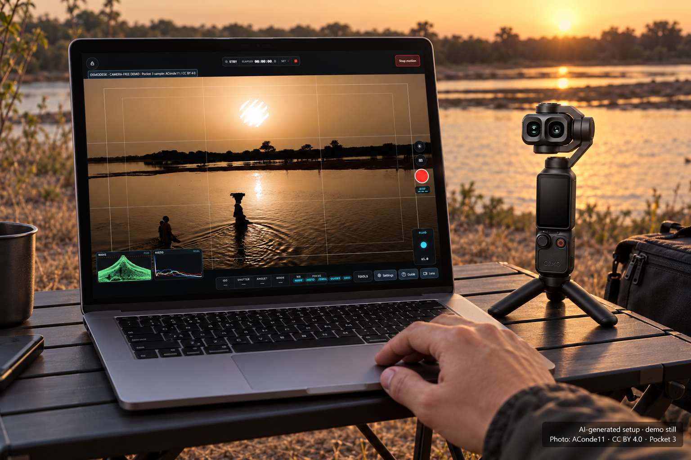
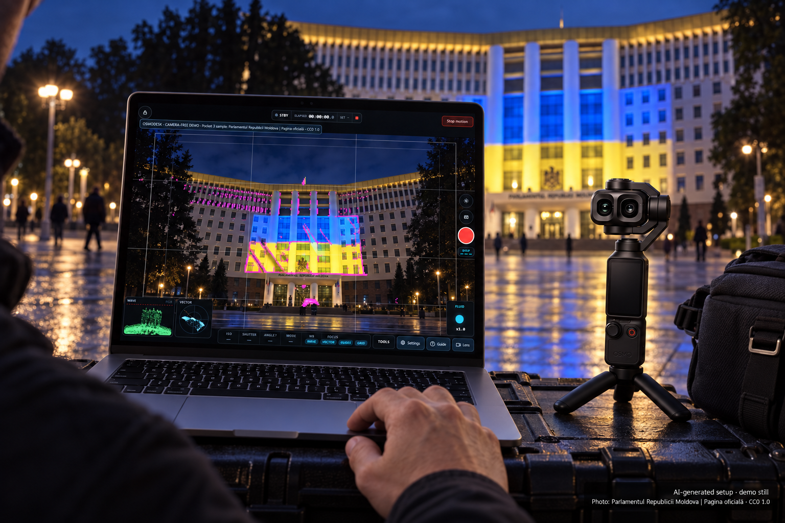

# OsmoDesk

Mobile and desktop browser controls for DJI Osmo Pocket cameras, backed by a Python host.
The browser can run on a phone, tablet or desktop; the host runs on a computer or Raspberry Pi
with access to the camera network. This is a browser-based controller, not a packaged native app.

## Included

- Shot Studio: Compose, Director, Shoot, Review and Rig workspaces, with offline position editing and a non-actuating path preview.
- Director rehearsal: framing beats, cue-aware playback and checked timing proposals with explicit Apply and Restore.
- Optional AI Shot Copilot: a creative brief becomes two locally checked timing treatments for existing framing points, with data disclosure, preview, explicit apply and restore.
- Shared-tab draft conflict protection and short-lived, ordered browser motion holds; STOP requires release before the same held gesture can resume.
- Restart-safe draft, slate and take journal; no camera connection or motion authority is restored automatically.
- Desktop, mobile and cinema-oriented control pages.
- BLE provisioning, Wi-Fi connection, camera telemetry and gimbal control.
- Live-view reception/HEVC handling, monitoring, LUT tools and camera controls.
- Motion planning, saved paths, limits, repeatability and timelapse workflows.
- Optional USB integration with [OsmoPalm](https://github.com/ElectronicPaper/OsmoPalm).
- Offline regression tests and a staged, rollback-aware Raspberry Pi deployment script.

Core2 firmware belongs exclusively to OsmoPalm. OsmoDesk does not require a Core2;
the serial driver remains here only as an optional integration adapter.

## A look at the setup



An imagined riverside setup with OsmoDesk's cinema monitor, framing guides,
zebras, waveform and histogram. The computer runs both the Python host and the
browser controls. This is an **AI-generated setup illustration**, not a real
photograph or a live-camera test. The screen is based on a licensed Pocket 3
sample still by AConde11, not footage from the pictured Pocket 4P.

[Actual desktop UI capture](docs/images/studio-shoot-demo-20260915.png) ·
[Actual cinema overlay capture](docs/images/cinema-overlay-demo-20260915.png) ·
[Cinema mobile UI capture](docs/images/cinema-mobile-demo-20260915.png)

These captures use the real interface with camera-free demo data and a saved panel
arrangement. No private camera footage is included. The stills are examples of
Pocket 3 imagery, **not a claim of tested Pocket 3 compatibility**.
See [photo sources and reuse licenses](docs/images/demo-samples/README.md).



An imagined architectural night shoot, with peaking, framing guides, waveform
and vectorscope over the demo picture. Based on a CC0 Pocket 3 photograph from
Parlamentul Republicii Moldova | Pagina oficială.
[Actual night overlay capture](docs/images/cinema-night-overlay-demo-20260915.png).

Both scenes are AI-generated; their screens and surroundings are illustrative,
not pixel-exact or the sample photographers' documented setups. The overlays in
the linked captures were calculated by the actual app from the sample stills,
not invented graphs or measurements from a connected camera.
Phones access the host over your trusted LAN; this is not a standalone
phone-to-camera app. See [all captures, earlier illustrations and generation
notes](docs/images/README.md).

## Run locally

Python 3.10+ is required. Create and activate a virtual environment, then:

```sh
python -m pip install -r requirements.txt
python server.py --no-core2
```

Open http://127.0.0.1:8722. The server starts disconnected; connect deliberately through
the UI. The landing page is Shot Studio (also /panel); specialist mobile and cinema pages are
/mobile and /cine. Do not use --autoconnect for an offline preview.
Live view requires **PyAV with HEVC support on the Python host**; the browser receives MJPEG.
If the decoder is unavailable, the host reports a live-view error. Use --no-live-view
for a control-only or camera-off session. Browser tests do not prove decoder compatibility.

For a phone on your trusted LAN, use `python server.py --lan --no-core2` and the
token-bearing URL printed by the server. Do not publish that URL or expose this R&D
HTTP service directly to the internet. Camera AP and LAN routing may need separate
network interfaces. Never run multiple camera owners at once.

Camera credentials are provisioned through BLE, or can be stored locally in an ignored
.env.local file using OSMO_SSID and OSMO_PASSWORD. Operator paths live in ignored moves/.
Neither credentials nor personal moves ship in this repository.

For an installation with versioned application releases, pass
`--state-dir /absolute/physical/directory`. Shots, workspace journal, AI preferences
and timelapse progress all use that directory. Symbolic links, Windows junctions
and parent traversal are refused; point directly at the persistent directory.
The Pi service uses its existing per-user persistent state location. Old releases
and their state links remain available for rollback.

The draft, slate and take journal use moves/workspace.json with a previous-snapshot backup.
A damaged journal is not overwritten: the previous snapshot can be loaded read-only and
the workspace reports that recovery is needed. Named shot files stay independent.
The UI distinguishes a durable save from a change accepted only in host memory.
Each tab has its own ephemeral controller identity, not a user account. A conflicting
author can export local edits or explicitly reload the host draft; stale edits are not
silently replayed. This remains a trusted-LAN tool, not an internet-facing multi-user service.

Take evidence is attached to the full shot version that actually ran. Returning to P1 or
rehearsing a segment does not replace that evidence. Manual log entries carry no motion proof.
Recording commands remain requests; fresh camera telemetry is shown separately as reported tally.
Roll waits up to five seconds for fresh recording confirmation before starting the
full pre-roll countdown. Missing or lost confirmation prevents motion. STOP and
Stop recording cancel the pending start. Timed-out recording requests are never retried automatically.
Waypoint zoom executes through the motion runner with readback/color guards (no D-Log2 zoom).
Continuous timelapse executes one finite, cue-free path; missed deadlines stop it without
catch-up bursts. Choose **Lens → Capture mode → Photo** before stills or either timelapse
workflow; choose **Video** again before recording. Switching is explicit, restricted to
Pocket 4-family identities, and requires camera acknowledgment plus fresh mode readback.
Profiles can retain different camera settings: inspect exposure/framing after switching.
Rejected, cancelled or timed-out shutters stop the sequence without advancing its count;
there is no automatic shutter retry. Progress counts acknowledged shutters, not verified image files. Interrupted
continuous sequences must restart; shoot-move-shoot retains explicit recovery.
The **Lens** button on every operator view opens autofocus, zoom and session-only Refocus A/B.
Refocus targets also change spot exposure metering and require explicit acknowledgement.
The complete four-command burst has one three-second acknowledgment deadline;
STOP cancels the wait, and a partial failure never triggers an automatic retry.
The Lens panel distinguishes all four command acknowledgments from optical sharpness.
For deliberate A/B recalls, use AF-S: our Pocket 4P demonstrated a visible
near/far/near focus change in AF-S, but not in the same AF-C test setup.
Even a failed request may already have changed metering.
The previous metering mode cannot be read or restored by OsmoDesk; review and
restore it on the camera or in DJI Mimo. Refocus A/B is not a reversible focus-only command.
Manual lens-distance/rack-focus control remains unavailable; autofocus targets are not a substitute.
Take comparisons report overlap, coverage, gaps and aborted context. Pixel figures are
angular estimates, not evidence that footage can be composited or that the rig has not moved.

## Rehearse in Director

1. Compose at least two positions. Open one beat at a time to adjust framing, easing and holds.
2. Open Director to inspect the sampled pan/tilt path. Preview, scrub or step through the beats;
   cue marks pause until **Continue preview**. None of these controls contacts the camera.
3. Enter a target duration or ask for a workable timing. Review and preview the proposal,
   then **Apply timing** deliberately. **Restore previous timing** is available until a later draft edit.
4. Use Shoot for actual rig rehearsal and recording requests. Telemetry loss or an invalid
   runtime target aborts programmed motion neutrally. A non-loop ping-pong move finishes after its return leg.

Director assesses at most 200 positions and one 24-hour cycle. Timing proposals reuse the
canonical motion engine, include fixed holds and round trips, and exclude human cue waits.
Travel violations cannot be repaired with timing alone. A passing sampled check is not a
physical guarantee; real tracking, smoothness, camera support and footage need rig verification.

## Optional AI Shot Copilot

AI is an addition to Director, not a camera operator. It can propose point names,
travel time, fixed holds and easing for **2–24 existing positions**. It cannot add
framing points, change angles/zoom/cues/rig setup, connect, arm, move or record.
Offline authoring, rehearsal and all existing controls work without it.

Open **Settings → AI** on the computer running OsmoDesk to enter a key, choose
the default model/effort and adjust session limits. Keys are memory-only by
default. Optional Windows Credential Manager storage keeps them out of JSON,
browser storage, exports and logs. Other platforms have no plaintext fallback.
Removing a key disables AI. Changing settings never resets already reserved costs.
A configured key is not a provider connection test. Every request still needs Send.

The existing environment/CLI path remains available for initial configuration:

```sh
python server.py --no-core2 --enable-ai
# Or select an existing local key file without copying its contents:
python server.py --no-core2 --enable-ai --ai-env /path/to/.env.local
```

In **Director → Shot Copilot**, describe the intent, review the exact shared context
and estimated cost, then choose **Send to OpenAI**. Rehearse a treatment before
applying it. A changed draft invalidates old proposals; application uses the same
shared-draft conflict checks as normal editing. Restore is available until a later edit.

- Luna/low is the economical default. Terra, Sol and Astra, with low/medium/high
  reasoning, are explicit choices. No automatic model substitution or paid retry.
- The key stays on the host. No live video, images, credentials, absolute framing
  coordinates, rig notes or take history are sent. Point labels are optional;
  the brief and relative angular travel/timing are always disclosed before sending.
- Requests use `store:false`, which is **not** zero retention. Standard OpenAI
  abuse-monitoring retention may still apply. Read the
  [OpenAI data policy](https://developers.openai.com/api/docs/guides/your-data).
- One request at a time, a 10-second cooldown, at most 20 requests and a **$1
  estimated reservation ceiling per server process** by default. Configure with
  `--ai-budget-usd` and `--ai-request-limit` (1–20). These are local admission
  estimates, not a provider invoice or account-wide spending cap. Reservations
  remain consumed on timeout/cancel/failure because billing may have occurred.
- Results are memory-only, expire after 20 minutes and disappear on restart.
  Cancellation discards results; it cannot promise cancellation of provider billing.
- AI is host-only by default. `--ai-lan` permits authenticated LAN operators to
  share that host's allowance; a tokenless exposed host cannot enable AI.

Saved app preferences take precedence on subsequent starts. Session-only keys
must be entered again after restart; offline authoring remains available.

## Make the desk yours

**Arrange panels** uses the offline-bundled [Snapgrid core](https://snapgrid.dev/react/docs/api/core/).
Move and resize handles work with pointers or the keyboard (arrows; Shift+arrows
to resize). Pin, Hide, Restore and Reset affect only the workspace layout—not
shots or rig settings. Desktop/tablet/phone layouts persist separately. Live
controls are paused during arrangement, and camera/canvas DOM nodes stay mounted.
The cinema picture, emergency stop and phone thumb controls remain fixed for safety;
phone System cards are arrangeable. Settings and Guide are shared across surfaces.
Labelled icons, keyboard-focus tooltips and expandable help keep explanations nearby.

The pinned bundle builds with `npm ci --ignore-scripts` then `npm run build:layout`.
Node is needed to rebuild assets, not to run the host. No CDN, React runtime,
or sibling checkout is required. See [layout licenses](web/vendor/THIRD-PARTY-NOTICES.txt).

## Crew, recovery and editorial handoff

- **Settings → Crew:** on a token-protected `--lan` host, the local owner issues
  viewer, editor or operator credentials lasting 15 minutes–24 hours. AI spending
  is a separate permission. Revoke closes that credential and its manual-control
  lease; pending AI results are discarded, but provider billing already in flight
  cannot be recalled. Credentials expire on host restart. Plain HTTP is unencrypted:
  use a trusted network, not the public internet. Host secrets/settings remain local-only.
- **Settings → Recovery:** inspect damaged/missing primary and backup state, then
  explicitly restore the validated backup or preserve the current in-memory draft.
  Current generation and file fingerprints are checked; originals become separate
  recovery copies. Nothing is armed, connected or commanded. Unsafe sources fail closed.
- **Review → Editorial package:** select 1–20 takes. Download immutable take evidence,
  each saved path, measured CSV/CHAN where available, and a SHA-256 manifest.
  Labels/notes are opt-in. Gaps, partial/aborted runs and unconfirmed recording stay
  explicit. Resampled motion frames are not video timecode or calibrated tracking.
- **Settings → Decoder:** inspect HEVC availability without starting a stream.
  Optional `python -m pip install --only-binary=:all: -r requirements-live.txt`
  installs the pinned PyAV 18.1.0 profile on Python 3.11+.
  [PyAV's release requirements](https://pypi.org/project/av/18.1.0/) explain platform wheels.
  Codec availability is not proof of camera stream compatibility.

Live synthetic requests passed for Luna, Terra, Sol and Astra at low, medium and
high effort on 2026-09-15. All 12 returned the requested model; 23 of 24 treatments
passed local preflight and one was blocked. This proves the integration, not
cinematic quality or physical camera operation. See the
[AI audit and research](docs/AI-SHOT-COPILOT.md) for scope and evidence.

## Verify

```sh
python -B -m unittest discover -s tests -t .
```

Node.js enables JavaScript syntax checks; Bash enables the offline deployment archive check.
These checks do not pair a camera or prove physical motion. To check compatibility with
a sibling OsmoPalm checkout, see [docs/CROSS_PROJECT.md](docs/CROSS_PROJECT.md).

`deploy/deploy-pi.sh --package-only output.tgz` creates a host-only archive without
firmware, credentials, captures or local moves. Actual Pi deployment requires an explicitly
chosen target; it was not performed during this repository split.

## Split verification (2026-09-07)

1,072 offline tests passed with no skips, including JavaScript syntax and deployment
archive checks. Six paired checks against OsmoPalm passed; a missing sibling fails the
explicit paired gate. A loopback-only server startup served all five checked pages/assets
without connecting a camera. The runtime dependencies are pinned to the verified versions.

## Shot Studio candidate

See [the audit, implemented decisions and verification boundary](docs/SHOT-STUDIO-AUDIT.md).
The [Director research and multi-lane audit](docs/DIRECTOR-RESEARCH.md) explains the new milestone,
the alternatives considered and the remaining product gaps.
For the optional real-browser regression, use an existing Node/Playwright installation:

```sh
python -B tools/verify_studio.py --node node
python -B tools/verify_studio.py --workspace --node node
python -B tools/verify_studio.py --ai --node node
```

Set `NODE_PATH` if Playwright is installed outside the project. Nothing is installed
automatically. The check uses temporary authoring data and a loopback server that
refuses hardware actions; it does not use your running host or saved shots.
Run `node tools/verify_session.cjs` for the camera-free shared browser transport regressions.

On Windows, `python -B tools/verify_vault.py --confirm-test-credential` explicitly
tests native credential storage using disposable synthetic values. It never reads
your API key, contacts a provider, or uses camera hardware; it removes its own test
entry and refuses to overwrite an existing credential. Normal offline tests do not
access the OS credential vault.

## Cinema Workspace preview verification (2026-09-15)

The development Pocket 4P passed BLE pairing/Wi-Fi connection, healthy telemetry,
720p decoding at approximately 30 fps (5,349 frames with no decoder errors), and a
bounded 0.6-degree pan followed by a stable stop. The operator confirmed that the
three-second recording request started and stopped on the camera. This observation
does **not** prove a saved video file. The newer telemetry decoder reports tally separately
when fresh; requested state is still labelled when camera feedback is unavailable.

Native Windows Credential Manager save/reload, rotation, removal, missing-key
fail-closed behavior and owned-entry cleanup passed with synthetic values.
See [release notes](RELEASE_NOTES.md) for the scope and remaining limitations.

## Status and attribution

This is a public experimental preview preserving existing host behavior, not a stable product
acceptance claim. Camera models/firmware and HEVC/browser capabilities vary. Some commands,
especially focus, are experimental; keep evidence gates and UI caveats intact.
Read [lessons](docs/LESSONS.md) and [third-party notices](THIRD_PARTY_NOTICES.md).
Not affiliated with DJI. Maintained by ElectronicPapers.

Pocket 4P is the project's development camera; this is not certification of every
feature or camera firmware. Pocket 3 and Pocket 4 have not been tested by us.
Do not treat offline tests as proof of camera compatibility or safe physical motion.

The source is available for inspection, but no blanket open-source license has yet
been selected for original project code. Included third-party code retains its own
licenses; public visibility does not replace those terms.
