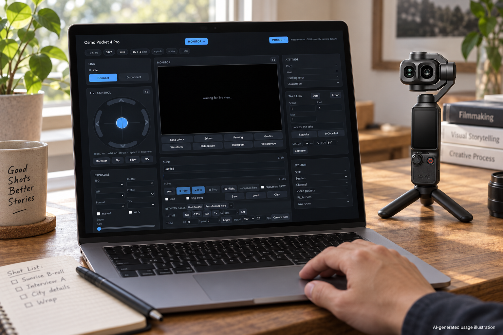
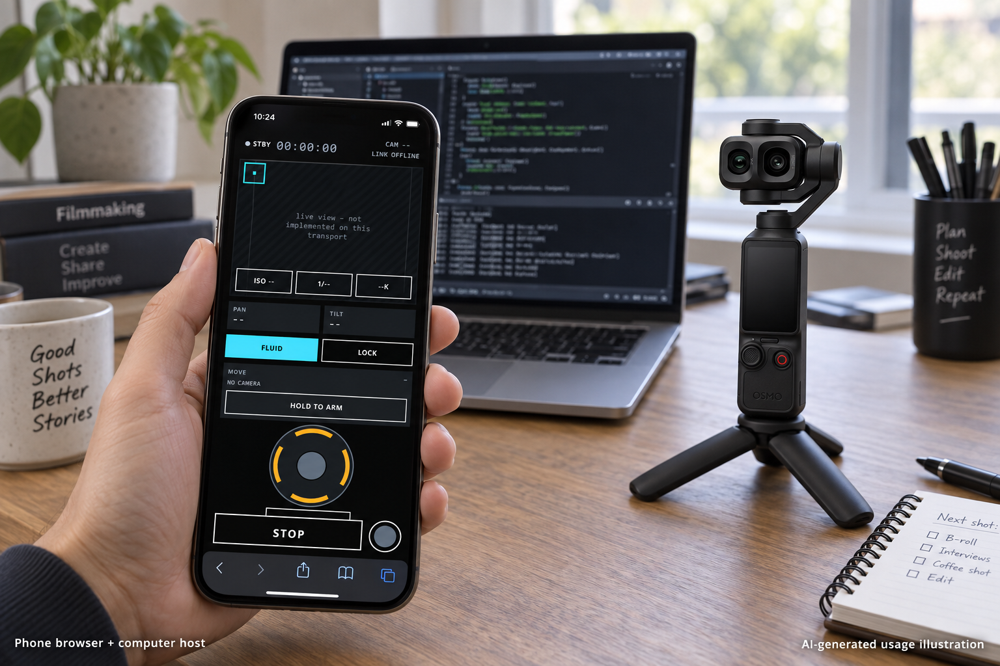

# OsmoDesk

Mobile and desktop browser controls for DJI Osmo Pocket cameras, backed by a Python host.
The browser can run on a phone, tablet or desktop; the host runs on a computer or Raspberry Pi
with access to the camera network. This is a browser-based controller, not a packaged native app.

## Included

- Desktop, mobile and cinema-oriented control pages.
- BLE provisioning, Wi-Fi connection, camera telemetry and gimbal control.
- Live-view reception/HEVC handling, monitoring, LUT tools and camera controls.
- Motion planning, saved paths, limits, repeatability and timelapse workflows.
- Optional USB integration with [OsmoPalm](https://github.com/ElectronicPaper/OsmoPalm).
- Offline regression tests and a staged, rollback-aware Raspberry Pi deployment script.

Core2 firmware belongs exclusively to OsmoPalm. OsmoDesk does not require a Core2;
the serial driver remains here only as an optional integration adapter.

## A look at the setup



Desktop: the computer runs both the Python host and the browser controls.



Mobile: the phone accesses the computer host over your trusted LAN; this is not
a standalone phone-to-camera app.

These are **AI-generated usage illustrations**, not real setup photographs or
evidence of successful operation. The screens use disconnected interface references.
See [actual static-page captures and generation notes](docs/images/README.md).

## Run locally

Python 3.10+ is required. Create and activate a virtual environment, then:

```sh
python -m pip install -r requirements.txt
python server.py --no-core2
```

Open http://127.0.0.1:8722. The server starts disconnected; connect deliberately through
the UI. Do not use --autoconnect for an offline preview. Mobile and cinema pages are
/mobile and /cine. Camera live-view codec support depends on the browser/platform.

For a phone on your trusted LAN, use `python server.py --lan --no-core2` and the
token-bearing URL printed by the server. Do not publish that URL or expose this R&D
HTTP service directly to the internet. Camera AP and LAN routing may need separate
network interfaces. Never run multiple camera owners at once.

Camera credentials are provisioned through BLE, or can be stored locally in an ignored
.env.local file using OSMO_SSID and OSMO_PASSWORD. Operator paths live in ignored moves/.
Neither credentials nor personal moves ship in this repository.

## Verify

```sh
python -B -m unittest discover -s tests -t .
```

Node.js enables JavaScript syntax checks; Bash enables the offline deployment archive check.
These checks do not pair a camera or prove physical motion. To check compatibility with
a sibling OsmoPalm checkout, see [docs/CROSS_PROJECT.md](docs/CROSS_PROJECT.md).

`deploy/deploy-pi.sh --package-only output.tgz` creates a host-only archive without
firmware, credentials, captures or local moves. Actual Pi deployment requires an explicitly
chosen target; it was not performed during this repository split.

## Split verification (2026-09-07)

1,072 offline tests passed with no skips, including JavaScript syntax and deployment
archive checks. Six paired checks against OsmoPalm passed; a missing sibling fails the
explicit paired gate. A loopback-only server startup served all five checked pages/assets
without connecting a camera. The runtime dependencies are pinned to the verified versions.

## Status and attribution

This is a public experimental preview preserving existing host behavior, not a stable product
acceptance claim. Camera models/firmware and HEVC/browser capabilities vary. Some commands,
especially focus, are experimental; keep evidence gates and UI caveats intact.
Read [lessons](docs/LESSONS.md) and [third-party notices](THIRD_PARTY_NOTICES.md).
Not affiliated with DJI. Maintained by ElectronicPapers.

Pocket 4P is the project's development camera; this is not certification of every
feature or camera firmware. Pocket 3 and Pocket 4 have not been tested by us.
Do not treat offline tests as proof of camera compatibility or safe physical motion.

The source is available for inspection, but no blanket open-source license has yet
been selected for original project code. Included third-party code retains its own
licenses; public visibility does not replace those terms.
