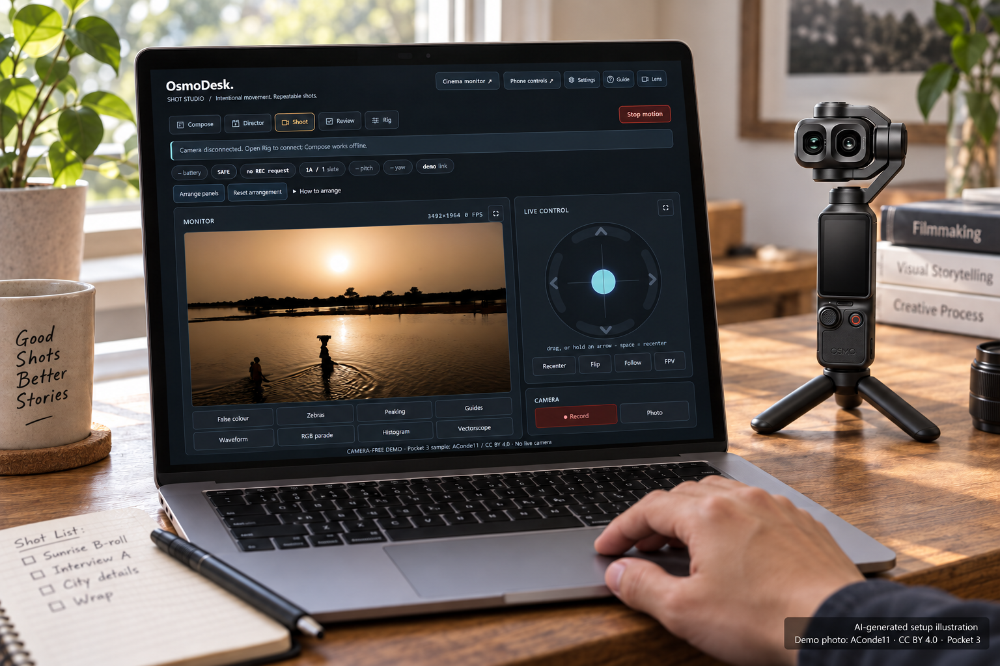

# OsmoDesk images

## Location scenes with active overlays — 2026-09-15

Two new 1536 × 1024 scenes created with the **built-in image-generation tool**.
The locations were invented to relate to the sample pictures, not to document
the actual photographers' setups. Both preserve the Pocket 4P equipment identity
and show the required laptop host. Screens are AI-rendered interpretations of the
actual captures below, not pixel-exact screenshots or connected-camera evidence.
All earlier illustrations remain available unchanged.

Actual camera-free captures from source `204884b` (runtime unchanged from the
earlier source `52044c8`):

- [Shot Studio overlays](studio-overlay-demo-20260915.png): 1440 × 1000;
  thirds, safe area, center mark and zebra highlights on the sunset.
- [Sunset cinema overlays](cinema-overlay-demo-20260915.png): 1440 × 1000;
  thirds/safe areas, zebras, waveform and histogram. Used in the riverside scene.
- [Night cinema overlays](cinema-night-overlay-demo-20260915.png): 1440 × 1000;
  thirds/safe areas, peaking, waveform and vectorscope. Used in the night scene.

These tools were enabled through the existing app's controls/handlers. The app
computed the overlays and scopes from the licensed stills; they were not drawn
as fake telemetry. A temporary camera-free host supplied synthetic preview
metadata and denied every POST. The night still was supplied by a local browser
fixture. No camera connection or physical command was used. Demo/credit labels
were added to the capture DOM, and the temporary host was stopped afterward.
Peaking and scopes here describe decoded demo-image pixels, not measured optical
focus or the camera's raw sensor signal. Keep the [source and license
credits](demo-samples/README.md) with shared copies.

### Riverside scene prompt

Use case: compositing. Create a NEW photorealistic OsmoDesk field-use illustration, landscape 1536x1024, by moving the equipment from image 1 into a completely different outdoor scene. Input 1: existing illustrated laptop and real DJI Osmo Pocket 4P dual-lens gimbal equipment to preserve as product identities, NOT a background/composition to keep. Input 2: actual OsmoDesk cinema-monitor screenshot, a supporting screen insert to reproduce faithfully. New scene: a quiet wide riverbank at golden-hour sunset, rippled amber water, low tree-lined far bank, natural warm haze matching the sunset inside the screen. A portable matte laptop sits securely on a compact dark folding field table on dry ground well back from the water; the Pocket 4P is beside it on a small tripod, a folded camera bag below, just an operator's relaxed hand near the trackpad. Make the composition entirely new, slightly elevated three-quarter editorial viewpoint, laptop display prominently readable on the left two thirds, correctly scaled Pocket 4P to its right, river behind. No indoor desk, houseplants, coffee mug or books. Preserve the exact Pocket 4P horizontal TWO lens head, gimbal arm, small vertical handle display, joystick, record button; never substitute a Pocket 3 single lens or another camera. The visible laptop screen must closely composite input 2: real sunset photograph, actual thin thirds grid and safe-area rectangles, actual diagonal zebra markings over the sun, lower-left waveform AND histogram, right-side record/joystick controls, bottom tools and Lens. Keep screen graphics anchored inside the screen perspective, never floating in the physical scene. Retain demo label; do not invent readings, a recording tally, focus distances or extra futuristic controls. Laptop is the required running host. Match the setting to the demo subject but do not pretend this is the photographer's real location or an actual test. Natural material wear, credible scale, subdued reflections, screen and camera both sharp, beautiful but candid, no lens-flare spectacle. Readable small lower-right two-line caption on subtle dark backing: 'AI-generated setup · demo still' and 'Photo: AConde11 · CC BY 4.0 · Pocket 3'.

### Night scene prompt

Use case: compositing. Create a NEW photorealistic OsmoDesk nighttime location-shoot illustration, landscape 1536x1024, using image 1 only to preserve the identities of the laptop and DJI Osmo Pocket 4P equipment, NOT its indoor scene or composition. Input 2 is the actual OsmoDesk cinema-monitor screenshot to faithfully insert on the laptop. Entirely new scene: an independent filmmaker's portable station on a broad paved urban plaza at blue hour/night. A modern monumental colonnaded building in the distance is illuminated blue and yellow, relating naturally to the architectural photograph displayed in the demo. Restrained practical street lighting and blue night ambient light, a few distant unidentifiable pedestrian silhouettes, slightly damp paving with subtle reflections, no heavy rain. Foreground laptop on a sturdy closed black equipment case at comfortable working height; Pocket 4P on a compact tabletop tripod beside it and a practical shoulder bag nearby. Close over-the-shoulder composition, dark sleeve and a natural hand near the trackpad, laptop screen as the clear focal point with building context visible beyond. Preserve real Pocket 4P's distinctive TWO horizontal lenses in its gimbal head, compact handle, joystick, red record button, believable size; not a single-lens Pocket 3. On laptop screen faithfully reproduce input 2's photograph and actual OsmoDesk monitoring tools OVER the picture: thin thirds/safe-area lines, magenta peaking marks already present in the source, lower-left green waveform and vectorscope, dark restrained record/joystick/tools controls. Do not add unsupported widgets or fake precise camera readings; preserve STBY/demo state. This is a Python host laptop and browser, no standalone phone claim. Never project UI into the physical air. This is an imagined related shooting setting, not the real sample photographer's setup or proof of camera operation. Realistic materials, comfortable understated cinematic night exposure, screen readable rather than glowing out, camera recognizable, not a neon sci-fi advertisement. Small readable lower-right caption: 'AI-generated setup · demo still'. Second smaller line: 'Photo: Parlamentul Republicii Moldova | Pagina oficială · CC0 1.0'.

## Current Shot Studio demo — 2026-09-15

- `osmodesk-cinema-workspace-illustration.png`: a new 1536 × 1024 version of the
  desktop illustration, produced with the **built-in image-generation tool**.
  The previous scene and Pocket 4P appearance were preserved; the screen uses the
  current Shot Studio capture. It is AI-generated, not a real setup photograph.
- [studio-shoot-demo-20260915.png](studio-shoot-demo-20260915.png): actual
  1440 × 1000 desktop UI capture with the credited Niger sunset sample.
- [studio-night-demo-20260915.png](studio-night-demo-20260915.png): the same
  interface with a second licensed Pocket 3 sample, an architectural night scene.
- [cinema-mobile-demo-20260915.png](cinema-mobile-demo-20260915.png): actual
  390 × 844 cinema-page viewport capture with the sunset sample.

The captures use source `52044c8` and a temporary, isolated, camera-free host.
The host supplied demo live-view metadata, a sample still, and a synthetic
three-position draft; all POST requests were denied. Motion stayed disabled,
camera values remained unknown, and no camera was connected. A browser-local
panel arrangement brought the monitor to the top; the source UI was not
rewritten. A capture-only footer labels the demo and credits the photograph.
The cinema page's image source was set to the sample in the capture DOM. The
night capture reuses the demo metadata, so the monitor's dimension label is
synthetic, not a measured stream size. Zero fps is deliberate: these are stills.

The phone needs a computer or supported rig host; none of these images implies
standalone phone-to-camera operation. Using Pocket 3 sample photographs does not
establish compatibility. The generated screen remains illustrative rather than
pixel-exact. No private camera footage, account data or camera identifiers were
used. The temporary host was stopped after capture.

Photo authors, original source links, licenses and adaptation notices:
[demo sample credits](demo-samples/README.md). Keep that attribution link with
public copies of the sunset screenshots or the new setup illustration.

### Current illustration prompt

Use case: compositing. Asset type: a new version of an OsmoDesk public-repository usage illustration, landscape 1536x1024. Image 1 is the existing illustration to edit; image 2 is the actual current OsmoDesk Shot Studio screenshot to composite onto its laptop display. Preserve the believable wooden desk, window daylight, hand on trackpad, laptop body, miniature tripod, and the EXACT black DJI Osmo Pocket 4P dual-horizontal-lens gimbal camera from image 1; do not redesign the camera or turn it into a single-lens Pocket 3. Replace ONLY the laptop's old interface with image 2, matched precisely to the screen plane and perspective. Screen: large clearly readable OsmoDesk heading, Compose / Director / Shoot / Review / Rig tabs, large warm Niger sunset photograph in the left monitor and cyan joystick in the right panel, charcoal UI, original controls and honest demo/disconnected state. Copy the supplied interface faithfully, not an invented dashboard; preserve its proportions and sample footer. The sunset is a licensed Pocket 3 SAMPLE photograph, not a live view from the camera on the desk. Keep the camera's own screen dark. Rendering should look like a candid high-quality editorial photograph with real textures and subtle screen reflections that do not obscure the UI. No extra phone, no extra lenses, no wireless beams, no invented controls. Remove the old bottom-right caption and replace it with a neat readable two-line caption on a restrained dark backing: 'AI-generated setup illustration' and 'Demo photo: AConde11 · CC BY 4.0 · Pocket 3'. Preserve all other scene subjects and make the current screen the focal point. This is a demo of the product layout, not evidence of connected camera operation.

## Earlier setup illustrations — 2026-09-09

Created with the built-in image-generation tool on 2026-09-09.

- desktop-usage-illustration.png: laptop browser and Python host beside a Pocket 4P.
- mobile-usage-illustration.png: phone browser with required computer host visible.
- desktop-interface.png and mobile-interface.png: actual static-page captures at
  1440x1000 and 390x844, respectively, from source ddfdc53. No camera backend
  was running. These are disconnected layout references, not connected-state proof.

The two usage illustrations are labelled AI-generated. Screen rendering and
hardware proportions remain illustrative, not pixel-exact screenshots or real
test photographs. They do not prove connectivity, performance or compatibility.
Camera identity used the official DJI Pocket 4P product-only reference from
https://store.dji.com/jp/product/osmo-pocket-4p?set_region=JP&vid=241282
(the reference itself is not redistributed here).

## Desktop prompt

Use case: photorealistic-natural. Create a landscape 1536x1024 OsmoDesk usage illustration. Image 1 is official DJI Osmo Pocket 4P appearance reference, NOT a scene to edit. Image 2 is the actual disconnected desktop interface reference, NOT an edit target. Show a realistic independent filmmaker's wooden desk in soft daylight: an open unbranded laptop, screen prominently facing viewer at natural angle, with the dark OsmoDesk browser interface based closely on reference 2. Reproduce its charcoal panels, blue circular joystick on left, central black monitor and motion controls, slim right telemetry panels. Leave monitor black/offline, no invented live camera footage, no fabricated connected status. Next to laptop stands a correctly scaled black DJI Osmo Pocket 4P on a miniature tripod, using reference 1's exact dual horizontal lenses, gimbal arm, rotatable screen, joystick and red-ring record button. An adult hand rests naturally on laptop trackpad. Laptop is the Python host as well as browser controller. No phone, no Core2, no extra cameras, no cables connecting camera and laptop, no glowing radio beams. Understated real material texture and proportions, recognizable equipment, not a futuristic concept. Small clean lower-right caption exactly "AI-generated usage illustration". This is a product usage concept, not hardware-test evidence. Screen is illustrative, not a pixel-exact screenshot.

## Mobile prompt

Use case: photorealistic-natural. Create a landscape 1536x1024 OsmoDesk mobile-browser usage illustration. Image 1 is official DJI Osmo Pocket 4P appearance reference; image 2 is the real disconnected mobile interface reference. Neither is an edit target. In a quiet daylight home filmmaking workspace, one natural adult hand holds an unbranded portrait smartphone in the foreground. Phone screen closely follows reference 2: black interface, top status row, black inactive monitor, pan/tilt cells, cyan FLUID control, amber circular control ring and large STOP at bottom. Keep offline status and monitor without camera footage; do not invent unsupported features. Include an open laptop visibly in the background on desk to represent the required running Python host, not optional decoration. A black real DJI Osmo Pocket 4P on a small tabletop tripod stands beside it, recognizable dual-lens horizontal head and correct gimbal/handle/buttons as in reference 1. Natural real-world scale, handheld phone crisp, laptop and camera still recognizable, soft depth of field. No Core2, no phone-to-camera cable, no wireless beams, no claims of direct phone Bluetooth control. Small readable lower-left text "Phone browser + computer host"; small lower-right caption exactly "AI-generated usage illustration". Restrained realistic materials and lighting, not a glossy advertisement. This is an illustrative setup, not proof of operation.
